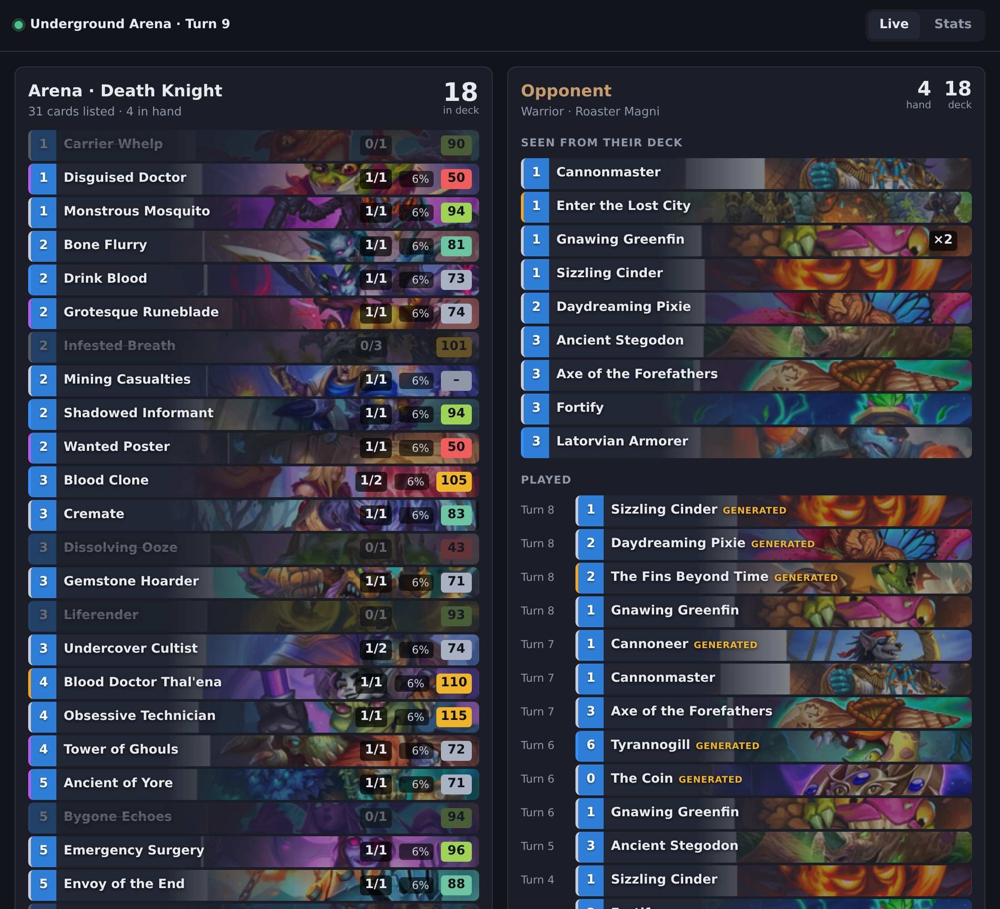
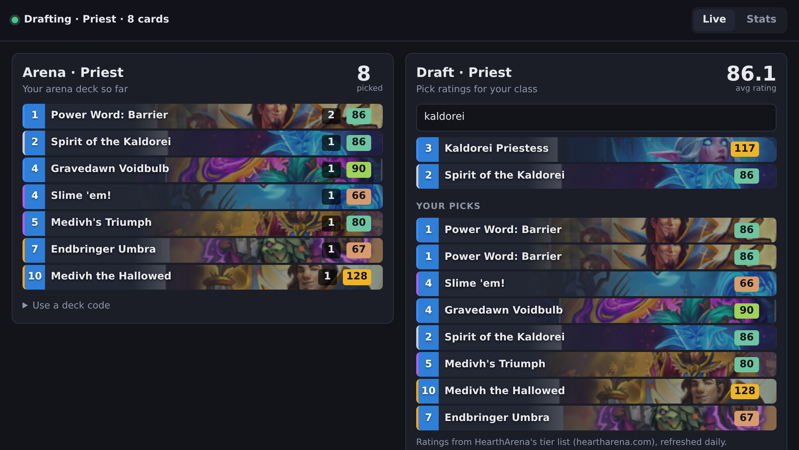
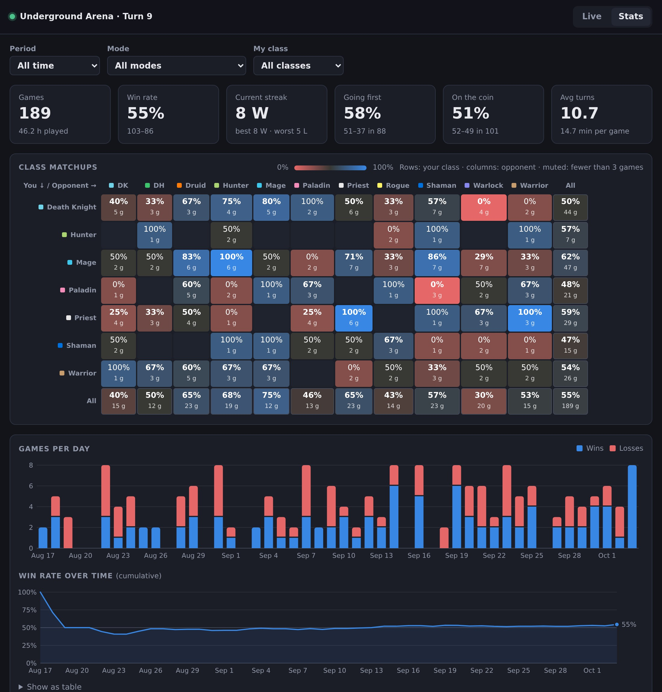

# Hearthstone Deck Tracker for Linux

A deck tracker for Hearthstone running under **Proton or Wine** on Linux. It was developed on Bazzite and should work on any distribution.
It reads Hearthstone's own log files and shows your remaining deck, your opponent's cards, Arena draft ratings and detailed stats in a browser window.

[](LICENSE)




## Features

- **Your deck, live.** Cards are crossed off as you draw them, with copies left and the chance to draw each one next.
  Your deck is detected automatically for Arena, Underground Arena and constructed games, or you can paste a deck code.
- **Your opponent's cards.** Every card they've played, by turn, with generated cards marked, plus everything revealed from their deck. Their hand and deck sizes are always shown.
- **Arena draft ratings.** [HearthArena](https://www.heartharena.com/tierlist) scores for every pick and for every card in your Arena deck. A quick lookup box shows the score of any card for your class.
- **Statistics.** Every game is saved locally. The Stats tab shows:
  - a class-vs-class win-rate matrix
  - win rates over time, by mode, going first vs. on the coin, by game length and by time of day
  - Arena runs, with average wins per class
  - win rates per card: when drawn, when in your opening hand, and when played
- **Catches up on missed games.** Games played while the tracker was off are imported from Hearthstone's logs the next time it starts.
- **Nothing to install.** Pure Python standard library, no packages and no build step. That suits immutable systems like Bazzite and SteamOS.
- **Doesn't touch the game.** It only reads log files that Hearthstone writes itself. No memory reading, no injection, nothing runs inside Proton.

| Arena draft ratings | Stats |
| --- | --- |
|  |  |

<sub>The stats screenshot shows sample data.</sub>

## Requirements

- Linux with Hearthstone installed through Battle.net under **Proton or Wine**. This includes a non-Steam game in Steam, Lutris, Bottles and Heroic.
- **Python 3.10 or newer.** It comes preinstalled on most distributions, including Bazzite and SteamOS.
- Any web browser.

## Installation

```sh
git clone https://github.com/justfaked/hs-decktracker-linux.git
cd hs-decktracker-linux
python3 -m decktracker setup
```

`setup` finds your Hearthstone install and turns on the log files the tracker needs, in `log.config` inside the Wine prefix. Your original file is backed up as `log.config.bak`.

**Restart Hearthstone afterwards.** It only reads `log.config` at startup.

## Usage

```sh
./decktracker.sh
```

This starts the tracker and opens **http://localhost:8765** in your browser. Keep the terminal open while you play and press <kbd>Ctrl</kbd>+<kbd>C</kbd> to stop.
The page updates live: put it on a second monitor, or next to the game in windowed mode.

| Option | Description |
| --- | --- |
| `--hs-dir PATH` | Hearthstone folder, if auto-detection doesn't find it, e.g. `".../drive_c/Program Files (x86)/Hearthstone"` |
| `--port 8765` | Port of the web page |
| `--host 0.0.0.0` | Make the page reachable from other devices, like a phone or tablet. It has no login, so only use this on a network you trust. |
| `--locale deDE` | Card language. By default it matches your game client. |
| `--db PATH` | Use a different history database |

**Tips**

- **While drafting in Arena,** type part of a card's name into the lookup box to see its rating for your class.
- **If your constructed deck isn't detected,** open *Use a deck code* and paste the code from Hearthstone's deck builder.
- **To open the Stats tab directly,** use **http://localhost:8765/#stats**.

## How it works

Hearthstone can write detailed logs of everything that happens in a game.
The tracker follows these files while you play:

| Log | Used for |
| --- | --- |
| `Power.log` | Every card, zone change and tag in the game: the game state |
| `Arena.log` | Arena drafts and your Arena deck |
| `Decks.log` | The constructed deck you queued with |

The tracker rebuilds the game state from these logs, saves each finished game to a local SQLite database and serves the page from a small local web server.

### Where data is stored

| What | Where |
| --- | --- |
| Match history | `~/.local/share/decktracker/history.db` |
| Card data and ratings (refreshed daily) | `~/.cache/decktracker/` |

The tracker only connects to the internet to download card data from [HearthstoneJSON](https://hearthstonejson.com) and the [HearthArena](https://www.heartharena.com) tier list. Card images are loaded by your browser from `art.hearthstonejson.com`.
Nothing about you or your games is sent anywhere.

## Limitations

- **Arena card counts are approximate.** `Arena.log` lists the cards in your Arena deck, but not how many copies of each.
  The number of cards left in your deck is always exact, and draw chances are based on it. The per-card list gets more accurate as you play, because the tracker learns copy counts from the cards you draw during a run.
- **The three cards offered during a draft aren't in the logs.** That's why the draft view has a lookup box instead of showing their ratings automatically.
- **Battlegrounds and Mercenaries** are detected but not tracked.
- **Hearthstone only keeps the logs of the last ~6 sessions.** Start the tracker regularly, or games older than that can't be imported.

## Troubleshooting

<details>
<summary><b>"Could not find a Hearthstone install"</b></summary>

Pass the path to the folder that contains `Hearthstone.exe`:

```sh
./decktracker.sh --hs-dir "$HOME/.local/share/Steam/steamapps/compatdata/<id>/pfx/drive_c/Program Files (x86)/Hearthstone"
```
</details>

<details>
<summary><b>The page keeps saying "Waiting for a game"</b></summary>

Make sure you ran `python3 -m decktracker setup` and restarted Hearthstone afterwards.
The tracker warns at startup if `log.config` is missing something.
</details>

<details>
<summary><b>My deck shows as "Unknown deck"</b></summary>

For constructed games the deck comes from `Decks.log`, which `setup` enables, so restart Hearthstone after running it.
You can always paste a deck code under *Use a deck code*.
</details>

## Development

```sh
python3 -m unittest discover -s tests -t .
```

| Path | Contents |
| --- | --- |
| `decktracker/power.py` | `Power.log` parser that rebuilds the game state |
| `decktracker/decks.py` | Deck detection from `Arena.log` / `Decks.log` |
| `decktracker/tracker.py` | Combines game state and deck into what the page shows |
| `decktracker/stats.py` | Statistics over the match history |
| `decktracker/web/` | The browser UI (plain HTML, CSS and JavaScript) |

Issues and pull requests are welcome.

## Credits

- [HearthstoneJSON](https://hearthstonejson.com) by HearthSim, for card data and card art
- [HearthArena](https://www.heartharena.com), for Arena card ratings
- Inspired by [Hearthstone Deck Tracker](https://github.com/HearthSim/Hearthstone-Deck-Tracker) for Windows

## Disclaimer

This project is not affiliated with or endorsed by Blizzard Entertainment.
Hearthstone® is a registered trademark of Blizzard Entertainment, Inc. Card names and images © Blizzard Entertainment.

## License

[MIT](LICENSE)

---

If this tracker is useful to you, you can support its development:

<a href="https://buymeacoffee.com/justfaked"></a>
